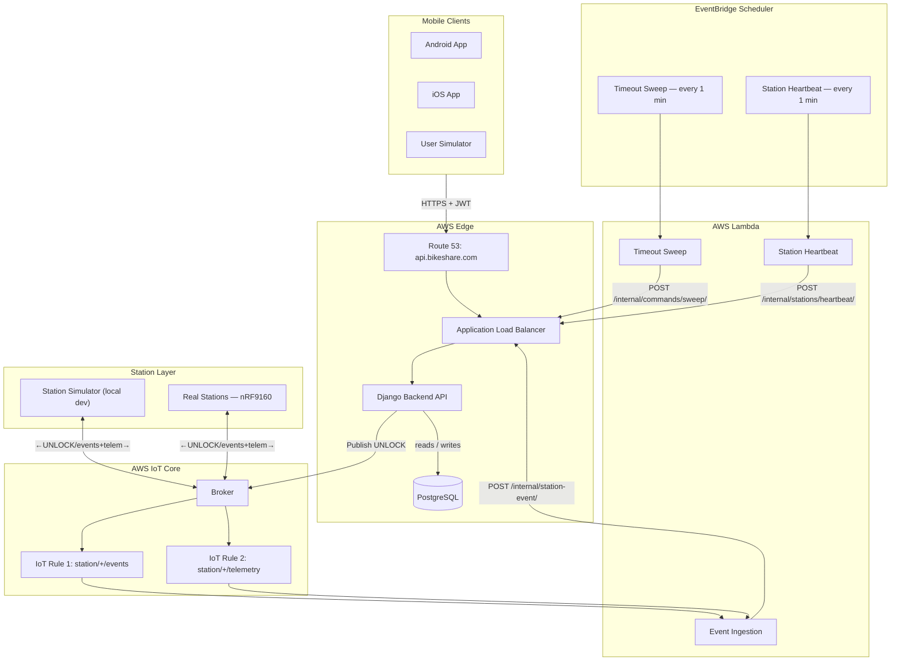

# Bikeshare Platform

See [`docs/system-architecture.md`](docs/system-architecture.md) for full architecture diagrams and design decisions.

## Architecture



---

## Prerequisites

- Python 3.11+
- [Docker Desktop](https://www.docker.com/products/docker-desktop/)

---

## First-time setup

```bash
git clone git@github.com:yeabb/bikeshare-platform.git
cd bikeshare-platform
make setup
```

`make setup` creates Python venvs for `backend/` and `simulator/`, installs dependencies, runs migrations, and seeds the DB with stations, docks, bikes, and test users from `simulator/fleet.yml`.

---

## Running the stack

### Full dev stack (normal workflow)

```bash
make dev
```

Starts Postgres + Mosquitto in Docker, then runs five processes natively via honcho:

| Process | What it does |
|---|---|
| `api` | Django dev server on `localhost:8000` |
| `listener` | Bridges MQTT station events into Django — local equivalent of the Lambda in production |
| `sweep` | Marks stale PENDING commands as TIMEOUT every 5s |
| `heartbeat` | Marks silent stations INACTIVE every 60s |
| `sim` | Station simulator — responds to unlock commands over MQTT and publishes telemetry |

You need all five running for the full ride flow to work. Without `listener`, station events are published but nothing processes them — bikes never unlock, rides never end.

### API only (e.g. for Android development)

```bash
docker-compose up
```

Starts Postgres, Mosquitto, and Django all inside Docker. `listener`, `sweep`, `heartbeat`, and `sim` are **not** started. Use this when you only need the API to be up (e.g. testing auth from the Android app) and don't need the full ride lifecycle.

### Stop

```bash
make stop   # stops Docker containers
```

---

## Routine dev workflow

Before each test session, re-seed to reset bike positions back to the starting state from `fleet.yml`:

```bash
make seed   # safe to run anytime, no duplicates
make dev    # skip if already running
```

Then in a second terminal, run the user simulator:

```bash
cd simulator

# Single user
.venv/bin/python -m user_sim.main --user +15550000001

# All users concurrently
.venv/bin/python -m user_sim.main

# Override bike (useful after bikes have moved between stations)
.venv/bin/python -m user_sim.main --user +15550000001 --bike B001
```

Watch Terminal 1 for the full station + backend event flow.

**Full reset** (wipe DB and start clean):

```bash
make stop
docker compose down -v   # removes volumes — DB is wiped
make dev
make seed
```

---

## Testing the unlock flow manually (curl)

You need two terminals. **Terminal 1** runs `make dev`. **Terminal 2** runs the curl commands below.

### 1. Request an OTP

```bash
curl -X POST http://localhost:8000/api/v1/auth/request-otp/ -H "Content-Type: application/json" -d '{"phone": "+15550000001"}'
```

In local dev the OTP is returned in the response (no SMS sent):

```json
{ "message": "OTP sent", "otp": "123456" }
```

### 2. Verify OTP and get a JWT token

```bash
curl -X POST http://localhost:8000/api/v1/auth/verify-otp/ -H "Content-Type: application/json" -d '{"phone": "+15550000001", "otp": "PASTE_OTP_HERE"}'
```

Copy the `access` token from the response.

### 3. Unlock a bike

Bike `B001` is at station `S001` (`always_success`).

```bash
curl -X POST http://localhost:8000/api/v1/commands/unlock/ -H "Content-Type: application/json" -H "Authorization: Bearer PASTE_TOKEN_HERE" -d '{"bike_id": "B001"}'
```

You'll get back `status: PENDING` and a `request_id`. Switch to Terminal 1 and watch — within a few seconds you'll see the unlock result, undock, ride, and return events play out automatically.

### 4. (Optional) Poll for the result

```bash
curl http://localhost:8000/api/v1/commands/PASTE_REQUEST_ID_HERE -H "Authorization: Bearer PASTE_TOKEN_HERE"
```

---

## Test users and fleet

Seeded from `simulator/fleet.yml`:

| Phone | Behavior | What they do |
|---|---|---|
| `+15550000001` | `commuter` | Always rides to S004, always returns the bike |
| `+15550000002` | `explorer` | Random destination, 15% chance of not returning |
| `+15550000003` | `ghost` | Random destination, 80% chance of never returning |
| `+15550000004` | `commuter` | Always rides to S005 — stale ride reconciliation demo |

| Station | Bikes | Unlock behavior |
|---|---|---|
| `S001` — Market & 5th | B001, B002, B003, B008 | `always_success` |
| `S002` — Mission & 16th | B004, B005 | `flaky` (30% fail rate) |
| `S003` — Castro & Market | B006 | `always_fail` |
| `S004` — Caltrain Station | B007 | `timeout` (never responds) |
| `S005` — Embarcadero | — | `silent_return` (unlocks succeed, BIKE_DOCKED suppressed) |

---

## Other useful commands

```bash
make test       # run the test suite
make migrate    # run database migrations
make seed       # re-seed dev data (safe to run multiple times)
make shell      # open a Django shell
```

---

## Project structure

```
bikeshare-platform/
├── backend/                  # Django backend
│   ├── apps/
│   │   ├── commands/         # Unlock command lifecycle + timeout sweep
│   │   ├── rides/            # Ride start and end
│   │   ├── stations/         # Station and dock state
│   │   ├── bikes/            # Bike state
│   │   ├── users/            # Auth (phone + OTP)
│   │   └── iot/              # MQTT publisher and event handler
│   ├── bikeshare/settings/   # base / local / production / test
│   └── requirements/         # base / local / production
├── simulator/                # Station and user simulators (local dev only)
│   ├── fleet.yml             # Fleet config — stations, docks, bikes, user behaviors
│   ├── station_sim/          # Responds to MQTT unlock commands, publishes events
│   └── user_sim/             # Drives the HTTP API flow (auth → unlock → poll)
├── docs/                     # Architecture, API, MQTT protocol, state machines
├── mosquitto/                # Mosquitto broker config
├── docker-compose.yml        # Postgres + Mosquitto + Django (API only, no background processes)
├── Makefile                  # Dev commands
└── Procfile                  # Process definitions for honcho (used by make dev)
```

---

## Docs

| Doc | What it covers |
|---|---|
| [`docs/system-architecture.md`](docs/system-architecture.md) | Component diagram, sequence diagrams, internal code flow |
| [`docs/api_v1.md`](docs/api_v1.md) | Full HTTP API reference |
| [`docs/mqtt_protocol.md`](docs/mqtt_protocol.md) | MQTT topics and event payload schemas |
| [`docs/state_machines.md`](docs/state_machines.md) | Command, Ride, Dock, Bike state transitions |
| [`docs/ai_context.md`](docs/ai_context.md) | Quick reference for AI-assisted development |
