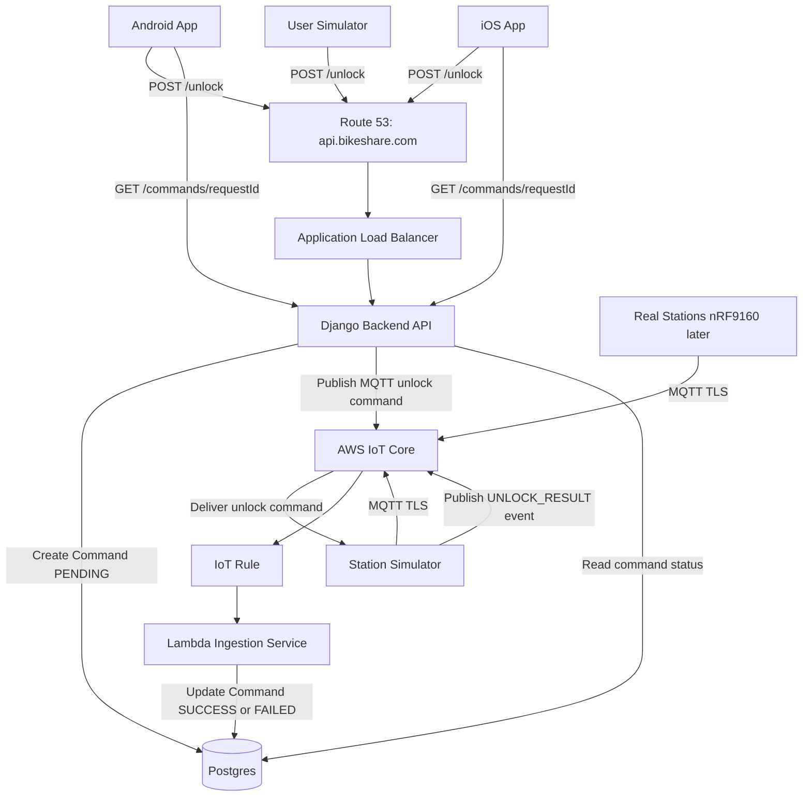

# System Architecture

```mermaid
graph TD

%% Mobile Clients
AND[Android App] -->|POST /unlock| R53[Route 53: api.bikeshare.com]
IOS[iOS App] -->|POST /unlock| R53
USIM[User Simulator] -->|POST /unlock| R53

%% Edge
R53 --> ALB[Application Load Balancer]
ALB --> ECS[Django Backend API]

%% Backend actions
ECS -->|Create Command PENDING| DB[(Postgres)]
ECS -->|Publish MQTT unlock command| IOT[AWS IoT Core]

%% Device layer
SSIM[Station Simulator] -->|MQTT TLS| IOT
STN[Real Stations nRF9160 later] -->|MQTT TLS| IOT

IOT -->|Deliver unlock command| SSIM
SSIM -->|Publish UNLOCK_RESULT event| IOT

%% Event ingestion
IOT --> RULE[IoT Rule]
RULE --> LAMBDA[Lambda Ingestion Service]
LAMBDA -->|Update Command SUCCESS or FAILED| DB

%% Mobile polling
AND -->|GET /commands/requestId| ECS
IOS -->|GET /commands/requestId| ECS
ECS -->|Read command status| DB
```
