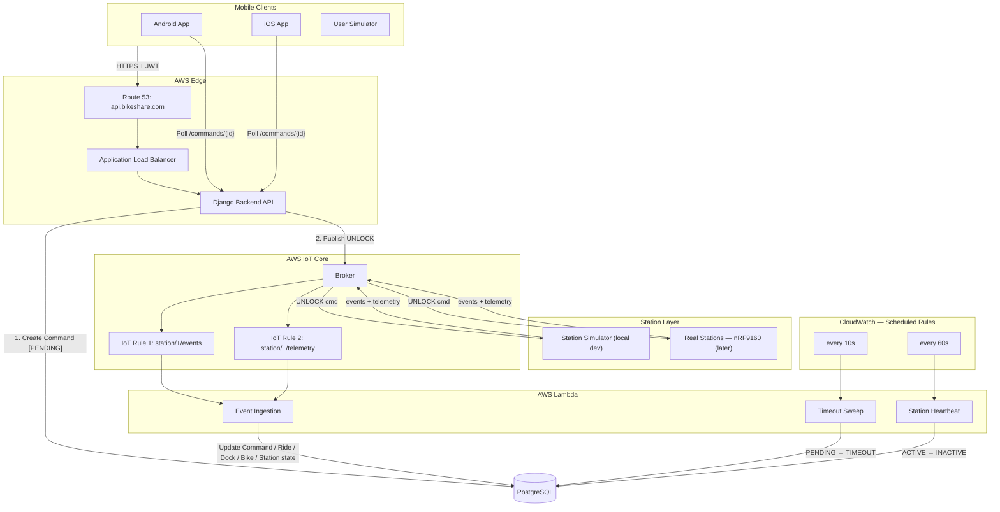
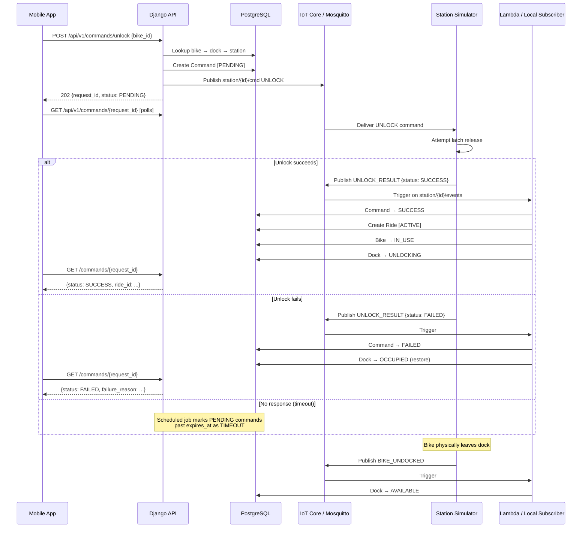
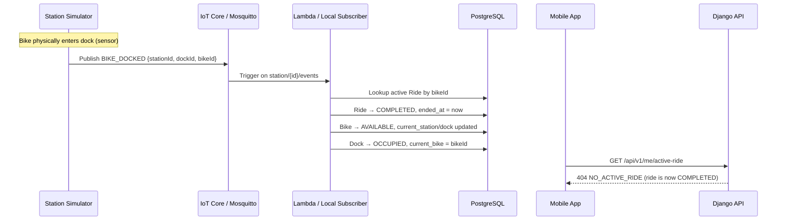
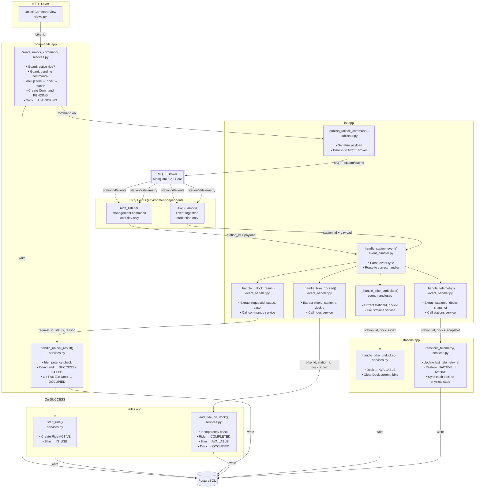

# System Architecture

## Component Overview



## Unlock + Ride Lifecycle (Sequence)



## Ride End (Sequence)



## Internal Code Flow (Unlock)

How a single unlock request flows through the backend code modules. This is the same regardless of whether you're running locally or in production — only the entry/exit points change.



### What each layer is responsible for

| Layer | File | Knows about | Does NOT know about |
|-------|------|-------------|---------------------|
| View | `commands/views.py` | HTTP request/response | MQTT, DB |
| Command service | `commands/services.py` | Business rules, DB | MQTT payload format |
| IoT publisher | `iot/publisher.py` | MQTT protocol | Business rules |
| Event handler | `iot/event_handler.py` | MQTT payload fields | Business rules, DB |
| Ride service | `rides/services.py` | Ride/Bike/Dock state | MQTT, HTTP |
| Station service | `stations/services.py` | Dock/Station state, telemetry reconciliation | MQTT, HTTP, Rides |

## Bike → Dock Mapping (Critical)

The user scans the **bike** QR code, not the dock. The backend maintains this mapping:

```
bike_id → (station_id, dock_id, status)
```

This mapping is updated by:
- `BIKE_DOCKED` event → bike now at new station/dock
- `BIKE_UNDOCKED` event → bike no longer at dock
- `UNLOCK_RESULT SUCCESS` → bike transitions to IN_USE

**The station must always include `bikeId` in `BIKE_DOCKED` events.** This is how the backend correlates a docking event to the active ride.

## Local Development

In local development AWS IoT Core and Lambda are replaced by two local processes:

| Production | Local equivalent |
|------------|-----------------|
| AWS IoT Core | Mosquitto (Docker) |
| Lambda ingestion function | `python manage.py mqtt_listener` — subscribes to `station/+/events` and `station/+/telemetry`, calls `event_handler` directly |
| CloudWatch every 10s → Lambda timeout sweep | `python manage.py sweep_timeouts` — marks stale PENDING commands TIMEOUT every 5s |
| CloudWatch every 60s → Lambda heartbeat | `python manage.py station_heartbeat` — marks silent stations INACTIVE every 60s |
| Real station hardware | `python -m station_sim.main` — simulates a fleet of stations, subscribes to `station/+/cmd`, publishes events + telemetry every 30s |

The backend publishes to Mosquitto via paho-mqtt (`MQTT_BROKER_TYPE=local`). Everything else — models, services, event_handler — is identical between local and production.

**Starting the full local stack:**
```bash
make setup   # first time only
make dev     # starts everything
```

**Fleet config:** `simulator/fleet.yml` defines stations, docks, bikes, and behavior modes.
Each station has a configurable behavior: `always_success`, `always_fail`, `flaky`, `slow`, `timeout`.

## Key Design Constraints

| Constraint | Why |
|------------|-----|
| Ride starts only on UNLOCK_RESULT SUCCESS | Never create a ride for a locked bike |
| Ride ends only on BIKE_DOCKED event | HTTP-based end would require trusting the client |
| Command is idempotent | Duplicate UNLOCK_RESULT events must not create duplicate rides |
| BIKE_DOCKED is idempotent | Already-completed rides must be ignored |
| bikeId in all dock events | Required to map events back to rides |
| Command has expires_at | Prevents permanently stuck PENDING commands |
